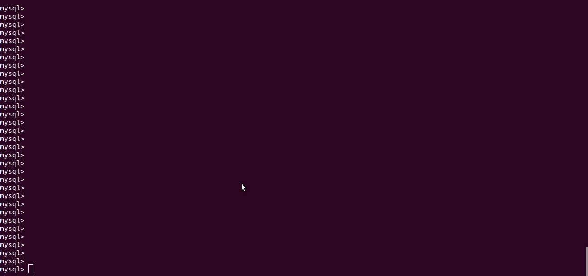
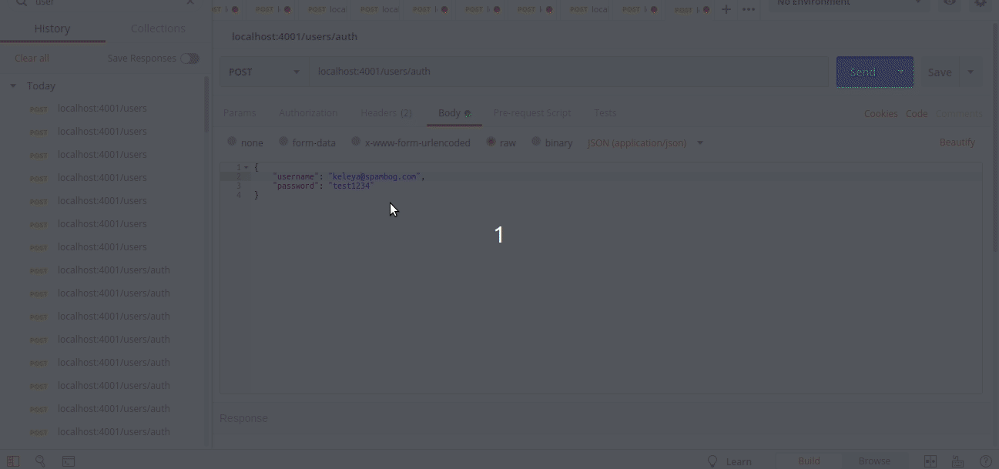
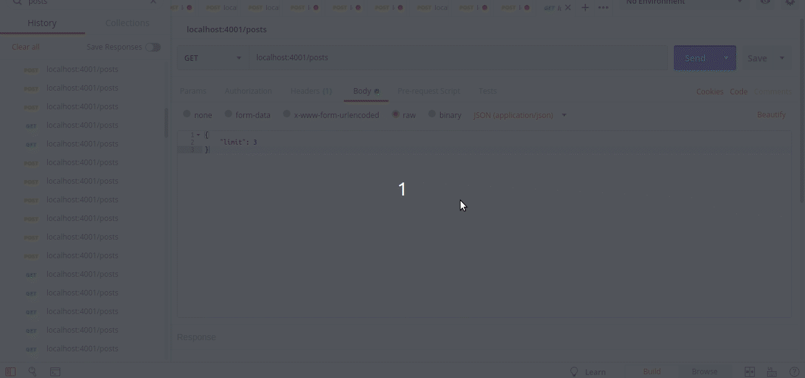
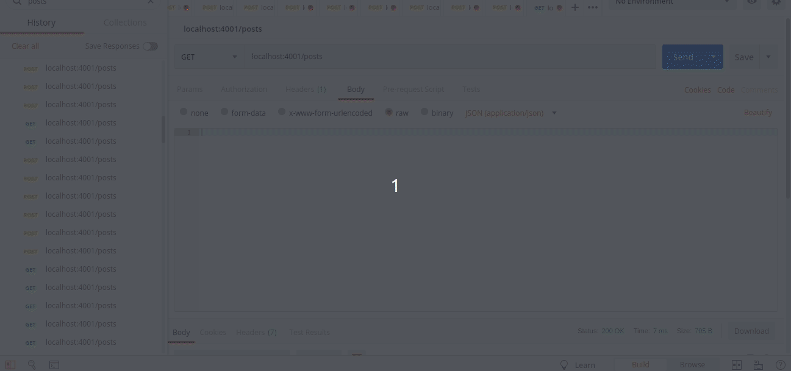
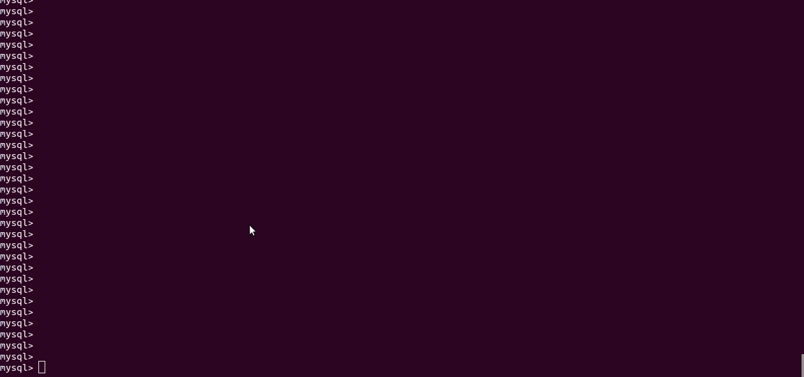

# Keleya's Challenge Test

## Introduction

Welcome to **[Keleya](https://keleya.de/)**

This is the documentation of the [Keleyas's Challenge Test](https://gist.github.com/dcvz/d6ab7f412a5022886f0dae737b7348b3). This tool was developed by me, **Sam Barros**, and I show you how to configure and use this tool.

## What you should install?

For this project, I decided to use MySQL, Express.js, TypeScript, and Node.js.
Firstly, you should install

-   [Mongo](https://www.mysql.com/) 8.0+
-   [ExpressJS](https://expressjs.com/) 4.16.3+
-   [TypeScript](https://www.typescriptlang.org/) 3.3+
-   [Node](https://nodejs.org/en/) 11.4.0+ (It's recommended to use 10.15.1 LTS)

The development environment was VS Code

-   [VS Code Studio](https://code.visualstudio.com/)

The package manager

-   [npm](https://www.npmjs.com/)

## Project Structure

For this project, the structure of the **Backend** is based on TypeScript and Node.

The structure is shown below

```
- Keleya
    - dist
    - node_modules
    - public
    - src
        - constants
        - intances
        - middlewares
        - models
        - routers
        - rules
        - services
```

You should create the folder `dist` in the keleya directory. This folder will receive the `JavaScript` files compiled by`TypeScript`.

```
$ cd keleya
$ mkdir dist
```

## Download

You can download the folder on my [GitHub](https://github.com/samaronybarros/keleya).

If you have git installed on your PC, you just need do as follow:

```
$ git clone https://github.com/samaronybarros/keleya.git
```

## Configuring App

If you have all the prerequisites installed you should verify if your MySQL is up.

```
$ cd keleya
$ npm install
```

## Starting application

To start application you should up the Typescript and node server, doing respectively (in different terminals):

```
$ npm run start:ts
```

and

```
$ npm run start:server
```

Or you can just type in the same terminal

```
$ npm run start:dev
```

## About app

The application's backend is formed by 5 `endpoints`

-   POST: /users - Creates a user — params:
    -   `username` - The name to give the user
    -   `password` - The password the user wishes to have
    -   `confirmPassword` - The password's confirmation the user wishes to have
    -   `@returns` - A secure authentication token



-   POST: /users/auth - Authenticates a user — params:
    -   `username` - The username of the user
    -   `password` - The password of the user
    -   `@returns` - A secure authentication token



-   GET: /posts - Returns all post (recent first) — params:
    -   `limit` - The max number of posts to return (default: 10)
    -   `@returns` - All the properties of the model



-   GET: /posts/{id} - Returns the post for the given id:
    -   `@returns` - All the properties of the model



-   POST: /posts - Creates a new post — params:
    -   `HEADER: X-TOKEN` - The authentication token of the user
    -   `@returns` - All the properties of the newly created model


